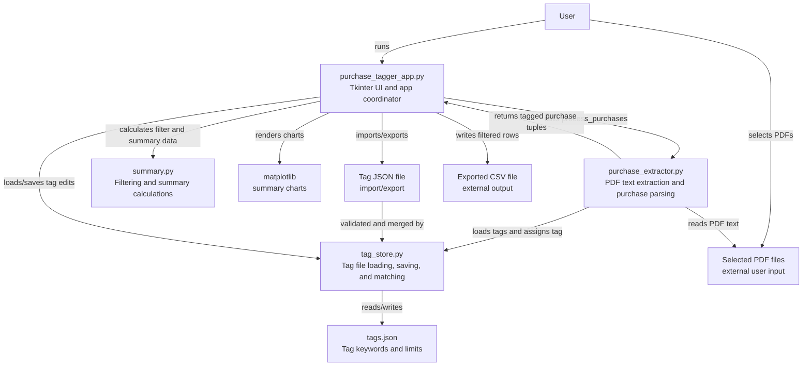

# File Interaction Map

Generated for the current workspace on 2026-06-08.

This project is a small Tkinter desktop app that reads purchase PDFs, extracts purchase rows, assigns tags from `tags.json`, shows/filter/summarizes results, imports/exports tag JSON, and exports CSV output.

## Current Workspace State

The current workspace includes the runtime files required by the app:

- `purchase_tagger_app.py`
- `purchase_extractor.py`
- `tag_store.py`
- `summary.py`
- `ui_state.py`
- `money.py`
- `views/`
- `version.py`
- `tags.json`

The test files cover tag storage, summary helpers, UI row mapping, and purchase parsing.

## Runtime Flow



## File-by-File Map

| File or directory | Status | Role | Reads from | Writes to | Used by |
|---|---:|---|---|---|---|
| `purchase_tagger_app.py` | Present | Main executable UI. Coordinates PDF selection, loading, table display, filtering, sorting, summaries, tag editing, tag JSON import/export, and CSV export. | `purchase_extractor.process_purchases`, `tag_store`, `summary`, selected PDF paths, user-selected tag JSON path | `tags.json` through `tag_store`, user-selected tag JSON path, user-selected CSV path | User directly runs it; `purchase_tagger_app.spec` packages it |
| `purchase_extractor.py` | Present | Extracts PDF text, parses purchase lines, normalizes purchase dates, tags parsed rows, and returns `(date, description, amount, currency, tag, limit)` tuples. | Selected PDF files, `tag_store.load_tags()` | None directly | Imported by `purchase_tagger_app.py`; tested by `test_purchase_extractor.py` |
| `tag_store.py` | Present | Central helper for locating, loading, saving, migrating, merging, and matching tag data. | `tags.json`, user-selected tag JSON path | `tags.json` when missing or explicitly saved, user-selected export path | App, extractor, and tag-store tests |
| `summary.py` | Present | Pure helper functions for text/month filtering, currency totals, and summary aggregates. | In-memory app rows | None | App summary views and `test_summary.py` |
| `ui_state.py` | Present | Pure helper functions for view filters, KPI stats, totals formatting, and selected-file labels. | In-memory app rows and tag settings | None | App workspace views and `test_ui_state.py` |
| `money.py` | Present | Shared Decimal parsing and formatting helpers for monetary values. | In-memory strings and numeric values | None | App, summary, tag store, UI state, and tag view helpers |
| `views/` | Present | UI view modules split out from the main app class. | Main app state and local helper modules | App state through bound methods | Imported by `purchase_tagger_app.py` |
| `version.py` | Present | Central release metadata for v1.0, including display title and release date. | None | None | Imported by `purchase_tagger_app.py`; included in `purchase_tagger_app.spec` |
| `tags.json` | Present | Runtime configuration/data store for tag names, keywords, and optional spending limits. | Read by `tag_store.py` | Updated by tag editor and tag assignment flows | App runtime and packaging |
| `docs/USER_MANUAL.md` | Present | End-user guide for installation, import workflow, tag management, summaries, export, backups, and troubleshooting. | None | None | Project documentation |
| `CHANGELOG.md` | Present | Release notes and verification commands for v1.0. | None | None | Project documentation |
| `installer/build_installer.ps1` | Present | Reproducible Windows packaging script. Builds the PyInstaller executable, creates an IExpress installer, and creates a portable ZIP with the user manual. | App sources, docs, `tags.json`, PyInstaller spec | `build/installer/`, `dist/PurchaseTagger-v1.0-Setup.exe`, `dist/PurchaseTagger-v1.0-portable.zip` | Maintainers |
| `requirements.txt` | Present | Runtime dependency list. | None | None | Install instructions |
| `requirements-dev.txt` | Present | Development/test dependency list. | `requirements.txt` | None | Test setup |
| `test_purchase_extractor.py` | Present | Pure parsing tests for `extract_purchases()`. | `purchase_extractor.py` | None | `pytest` |
| `test_purchase_tagger_app.py` | Present | UI row-mapping tests using lightweight fakes. | `purchase_tagger_app.py` | None | `pytest` |
| `test_summary.py` | Present | Summary and filtering tests. | `summary.py` | None | `pytest` |
| `test_tag_store.py` | Present | Tag loading, saving, migration, and matching tests. | `tag_store.py` | Temporary JSON files | `pytest` |
| `purchase_tagger_app.spec` | Present | Tracked PyInstaller build recipe for producing the desktop executable. | App sources, `tags.json`, CustomTkinter runtime assets | `build/`, `dist/` when PyInstaller runs | PyInstaller |

## Data Shape Contracts

`purchase_extractor.extract_purchases(full_text)` returns:

```python
(date, description, amount, currency)
```

`purchase_extractor.process_purchases(pdf_path)` returns:

```python
(date, description, amount, currency, tag, limit)
```

`purchase_tagger_app.py` stores display rows as:

```python
[date, description, formatted_amount, currency, tag]
```

`tags.json` uses:

```json
{
  "tag_name": {
    "keywords": ["KEYWORD"],
    "limit": 0
  }
}
```

Older list-only tag values are migrated in memory by `tag_store.load_tags()`.

Tag JSON export uses the same structure and suggests `tag_list.json` as the default filename. Tag JSON import is additive: new tags are added, missing keywords are appended, duplicate keywords are skipped, and imported limits replace current limits for matching tag names.

## External Dependencies

| Dependency | Used by | Purpose |
|---|---|---|
| `tkinter` | `purchase_tagger_app.py` | Desktop UI, dialogs, tables, and menus. |
| `matplotlib` | `purchase_tagger_app.py` | Embedded summary charts. |
| `customtkinter` | `purchase_tagger_app.py`, `views/tags.py` | Modern desktop UI widgets and runtime assets. |
| `pypdf` | `purchase_extractor.py` | Reads PDF pages and extracts text. |
| `pyinstaller` | Packaging | Development/build tool for producing the desktop executable from `purchase_tagger_app.spec`. |
| `pytest` | Tests | Development-only test runner. |

`pytest` is the standard test workflow for this project; `unittest discover` does not cover every test file.

## Maintenance Checklist

Update this map when:

- A Python file imports a new local module.
- A function starts reading or writing a project file.
- The shape of `tags.json` or purchase rows changes.
- Packaging inputs in `purchase_tagger_app.spec` change.
- New test, dependency, or generated-output conventions are added.
- Release metadata changes in `version.py`.
